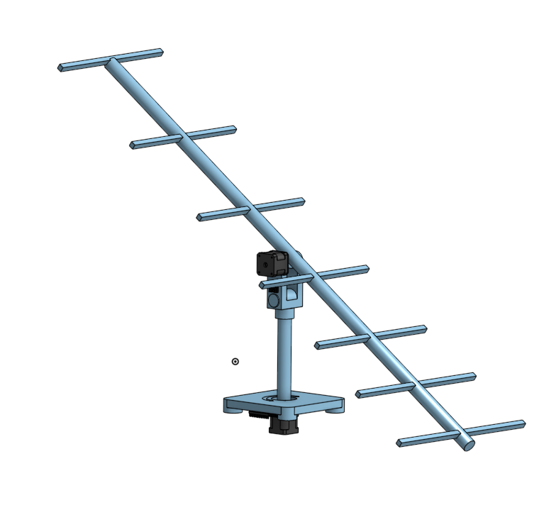
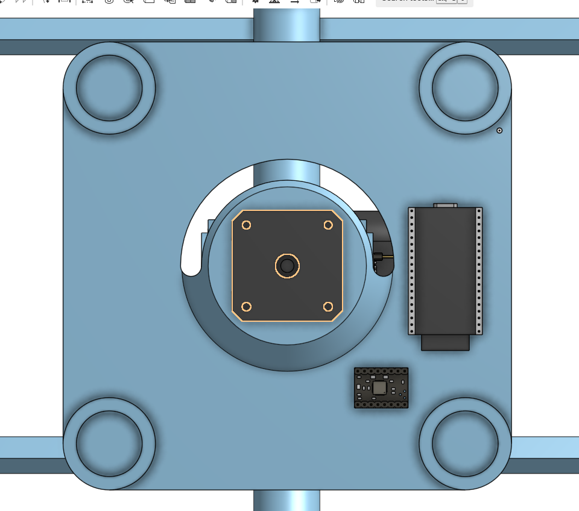

# Aero Track

Why should directional antennas be handicapped by the fact theyre directional, i made a rig (can be used with any directional antennas) that can be used to track a target anywhere on the earth
It will do all the math to point the antennas towards a GPS coordinate, It does have its own GPS but if you dont want to use it its totally upto you its just there for quality of life and ease of use at the field.
This project was developed to aid my Long range endurance UAV project that i also submitted for stardance and got funding from, This will help me make a groundstation that can have insane range without sacrificing directionality

Where has my love for yagi antennas brought me 😍😍✌️✌️


___

I will be implementing full support with the Mavlink protocol so you can either directly plug ur mavlink telemetry reciever in or route the data through a laptop

## System Architecture

It uses two stepper motors with encoders for pitch and yaw 

```
base.rotation.y = atan2(local_target.x, local_target.z)
antenna.rotation.x = -atan2(local_target.y, Vector2(local_target.x, local_target.z).length()) + deg_to_rad(90)
```
(lines taken straight out of my game code btw it does work irl too)

These two formulas will be used to point the yagi towards the location i want it to point to, which will ofcourse be GPS coords in this case

I have tested this in my game which i ALSO submitted for stardance and got a superstar on 



### Electronics

[bom.csv](./bom.csv)

### Antenna

Yagi is a highly directional antenna which has insane range for anything thats directly infront of it, its used a LOT in TV communication and for groundstations where they know the position of the gs and they directly point it to that point
Hugely used in aerospace 

### 433 MHz Yagi

### 433 MHz Yagi — Element Dimensions

| Element | Length (mm) | Distance from Reflector (mm) |
|---|---|---|
| Reflector | 346 | 0 |
| Driven (dipole) | 329 | 138 |
| Director 1 | 311 | 276 |
| Director 2 | 308 | 486 |
| Director 3 | 305 | 767 |
| Director 4 | 303 | 1024 |
| Director 5 | 301 | 1257 |

## Wiring


### Pin Connections

| Signal | ESP32 Pin | Connects To |
|---|---|---|
| Yaw Step | GPIO 25 | Stepper Driver 1 (STEP) |
| Yaw Dir | GPIO 26 | Stepper Driver 1 (DIR) |
| Yaw Enable | GPIO 27 | Stepper Driver 1 (EN) |
| Pitch Step | GPIO 14 | Stepper Driver 2 (STEP) |
| Pitch Dir | GPIO 12 | Stepper Driver 2 (DIR) |
| Pitch Enable | GPIO 13 | Stepper Driver 2 (EN) |
| Yaw Encoder SCK | GPIO 18 | MT6835 #1 (SPI SCK) |
| Yaw Encoder MISO | GPIO 19 | MT6835 #1 (SPI MISO) |
| Yaw Encoder MOSI | GPIO 23 | MT6835 #1 (SPI MOSI) |
| Yaw Encoder CS | GPIO 5 | MT6835 #1 (SPI CS) |
| Pitch Encoder CS | GPIO 15 | MT6835 #2 (SPI CS, shares SCK/MISO/MOSI) |
| GPS RX | GPIO 16 | GPS Module TX |
| GPS TX | GPIO 17 | GPS Module RX |
| MAVLink RX | GPIO 3 (RX0) | Telemetry Radio TX |
| MAVLink TX | GPIO 1 (TX0) | Telemetry Radio RX |
| Motor Power | VMOT | 12V Supply |
| Logic Power | 3.3V | ESP32 / Encoders |

Note: The encoder pins might be different for different encoders


## Design process
### The 433 Dipole 
Coming soon... (i dont wanna provide any false instructions)
### Firmware
Coming soon...
### Screws
insert all the provided heatset inserts before moving on to assembling the rig, the longer inserts go in the baseplate and keep in mind to leave space at top so that the screws can sit flush
the smaller 3mm inserts are tapped on the yaw arm
### Assembling the rig
1. Start by taking your boom and place the first reflector element at the end, cut the reflector to match the size given in the chart above (keep in mind it should be symmetric)
2. Place the dipole you just created 13.8cm ahead of it
3. Match the table for however many directors you want (the more the more directional it becoems)
4. Put the YagiBoomMount.step under the CG of the yagi antenna
5. Take out your 6000 bearings and slide them in the yaw arm
6. position the yagi antenna boom mounts notch inside the bearing and side your nema 17 from the side screwing it in the place
7. Slide down your 2.5cm stick under the yaw arm and superglue it in place
8. Use a lathe or drill a hole to put a 5mm shaft inside the 2.5cm shaft so that it sticks out
9. Screw your Nema17 under the baseplate before you begin the assembly
10. Slide the 6005 bearings in the base plate then follow it by adding the yawarm in, use the aluminum coupling to screw both in place
11. Rougly connect everything according to the wiring diagram to the ESP32 and mount the GPS as away from the yagi on baseplate facing up
